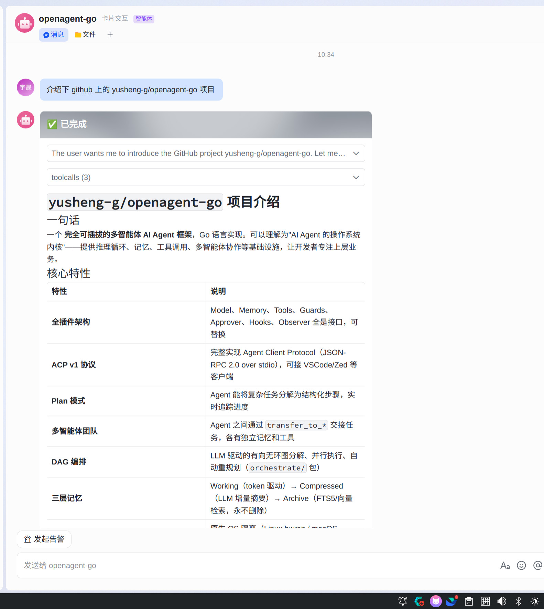
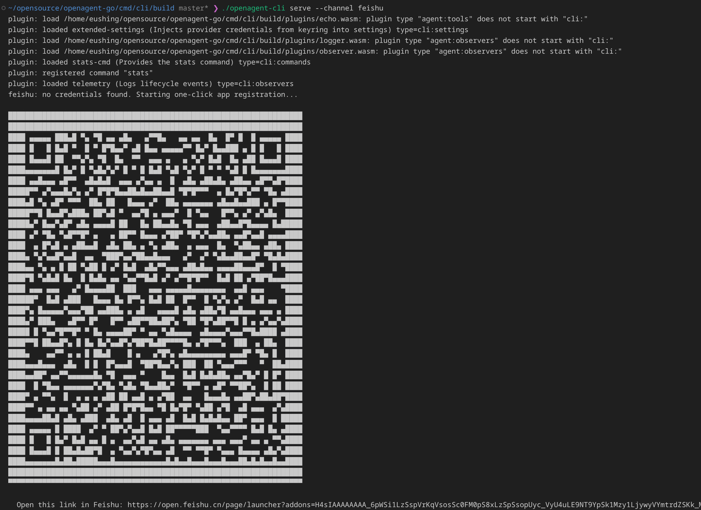
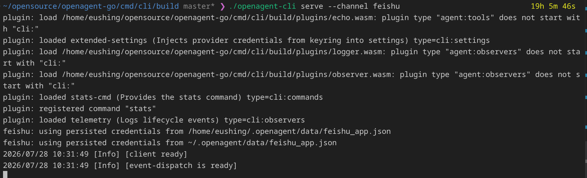

<div align="center">
  

  Go 语言实现的 AI Agent 运行时内核 — 可插拔、沙箱隔离、原生 ACP 协议。

  [](https://pkg.go.dev/github.com/yusheng-g/openagent-go)
  [](https://goreportcard.com/report/github.com/yusheng-g/openagent-go)
  [](https://github.com/yusheng-g/openagent-go/stargazers)
  [](https://github.com/yusheng-g/openagent-go/discussions)
  [](https://github.com/yusheng-g/openagent-go/pulls)
  [](LICENSE)

  [English](README.md) · [Architecture](DESIGN.md) · [架构 (中文)](DESIGN.zh.md)

  如果 openagent-go 对你有帮助，请在 GitHub 上点个 ⭐！
</div>

## 特性

- **全插件架构** — 每个组件都是接口：Model、Memory、Tools、Guards、Approver、Hooks、Observer
- **ACP v1 协议** — 完整的 Agent Client Protocol 实现，基于 stdio（JSON-RPC 2.0）。可用任何 ACP 客户端（VSCode 插件、Zed 等）
- **Plan 模式** — `plan_create`/`plan_update` 工具让 agent 将复杂任务分解为结构化步骤，实时追踪进度
- **多智能体团队** — agent 之间通过 `transfer_to_*` 工具交接任务；每个 agent 有独立的记忆、工具和守卫
- **多智能体编排** — LLM 驱动的 DAG 分解、并行执行和自动重规划（`orchestrate/`）
- **SSE 流式输出** — 实时逐 token 渲染，支持 reasoning 展示、工具调用卡片
- **结构化工具结果** — `ToolResult` 携带内容/JSON/错误/截断状态；超长输出自动落盘（按行包装、read/grep 可读），不淹没模型上下文
- **审批策略引擎** — 分层策略链（规则 → 安全 → 审批记忆 → 人工），支持参数编辑和跨重启的 "始终允许" 决策
- **自我进化** — LLM 提取器将完成的对话转化为持久知识，在后续会话中召回
- **三层记忆系统** — Working（token 驱动）、Compressed（LLM 增量摘要，`summarizer/`）、Archive（向量/关键词检索，永不删除）；三层均可插拔 Provider，含远程 OpenViking 上下文数据库
- **沙箱环境** — 原生 OS 级别隔离（Linux bwrap、macOS Seatbelt），安全执行 shell、文件、网络操作
- **WASM 插件** — Agent 级：`agent:tools` 和 `agent:observers` 接入工具/观测器管线。CLI 级：`cli:settings`、`cli:commands`、`cli:observers`、`cli:http`，用于设置注入、命令扩展、生命周期监控和自定义 HTTP 路由。任意插件均可声明 cron 定时任务。
- **静态上下文配置** — `AGENTS.md`（工作规则）和 `SOUL.md`（性格与底线），支持用户级和项目级覆盖
- **Slash 命令** — 内置 `/help`、`/mode`、`/model`、`/compact`、`/context`、`/cwd`、`/clear`、`/rename`、`/sessions`，通过 `slash/` 注册表扩展
- **完整 CLI** — `openagent`，cobra 命令、配置驱动模型、keyring 密钥管理、WASM 插件运行时
- **IM 频道** — 飞书/Lark（WebSocket，卡片式流式输出：Markdown 渲染、工具调用卡片，一键扫码创建应用，内嵌审批按钮、/clear 和 /mode 命令）、个人微信（腾讯 ilinkai 官方通道，扫码登录 + 配对码，/clear 命令）、企业微信（官方长连接，原生流式回复，扫码自动创建机器人，/clear 命令）
- **RunHooks 状态传递** — Start/End 回调共享不透明状态，OTEL 正确嵌套 span，slog 精确计时
- **动态上下文** — 会话级 plan 状态和 mode 指令每轮自动注入 prompt

## 快速开始

```bash
# 编译 CLI
go build -o openagent ./cmd/cli/

# 查看版本号
./openagent -v

# ACP 模式（stdio — 配合 VSCode/Zed ACP 插件使用）
./openagent serve --acp

# REST 模式（HTTP + SSE）
./openagent serve --port 8080

# 一次性流式对话
./openagent run "你好，请介绍一下你自己"

# 启用 OS 原生沙箱执行 shell 命令
./openagent serve --sandbox --port 8080

# 按需开关能力（默认：memory/summarizer/skills/mcp/embedder 开，guard/approver 关）
./openagent serve --guard on --approver on

# 静默所有日志输出
./openagent serve -q --port 8080

# 管理系统密钥环里
./openagent keyring set mykey keyvalue
./openagent keyring get mykey
```

### 配置

创建 `~/.openagent/settings.json`（其中的 `openagent` 叶子段是 `version.Name`,默认 `openagent`;用 `-X ...version.Name=myagent` 注入的构建会读 `~/.myagent/`）：

```json
{
  "provider": {
    "openai": {
      "base_url": "https://api.openai.com",
      "api_key": "sk-...",
      "models": ["gpt-4o"]
    }
  },
}
```

将 `AGENTS.md` 和 `SOUL.md` 放在 profile 目录（默认 `~/.openagent/profile/`；当 `OPENAGENT_CLI_CONFIG` 将 settings 指到别处时为旁边的 `<config-dir>/profile/`）来自定义 agent 的行为。项目级 `$(pwd)/AGENTS.md` 优先覆盖。

连接 ACP 客户端（VSCode/Zed 插件）。

#### Web 搜索后端

`websearch` 工具支持两个后端，通过 `OPENAGENT_WEB_SEARCH_ENGINE` 选择：

| 引擎 | 默认 | 国内可达 | API key | 环境变量 |
|------|------|---------|---------|---------|
| `tavily` | 是 | 有时（AWS us-east） | 可选（keyless 可用） | `TAVILY_API_KEY`（提高速率限额） |
| `bocha` | 否 | 是 | 必需 | `BOCHA_API_KEY` |

默认 `tavily`（keyless，无需账号）。如果 Tavily 在你的网络下不可达，错误信息会附带切换提示。使用博查（推荐国内用户）：

```bash
export OPENAGENT_WEB_SEARCH_ENGINE=bocha
export BOCHA_API_KEY=<你的-key>   # 在 https://open.bochaai.com 获取
```

### 飞书集成

将 agent 接入飞书（Lark），支持群聊、私聊、Markdown 卡片渲染、流式输出。



**首次使用（无需凭据）：**

```bash
./openagent serve --channel feishu
```

终端会出现二维码。打开飞书 App 扫码，确认创建应用即可。SDK 会自动创建机器人应用并配置好权限（`im:message`、`im:message:send_as_bot`、`im.message.receive_v1` 事件、`card.action.trigger` 审批/模式按钮回调），凭据保存在本地。



**如果已有应用，在 `settings.json` 中配置：**

```json
{
  "provider": {
    "openai": { "api_key": "sk-...", "models": ["gpt-4o"] }
  },
  "channels": {
    "feishu": {
      "app_id": "cli_xxxxxxxxxxxxxxxx",
      "app_secret": "xxxxxxxxxxxxxxxxxxxxxxxxxx"
    }
  }
}
```

然后带 flag 启动：

```bash
./openagent serve --channel feishu
```

`--channel` flag 是必须的 — 仅配置 settings.json 不会自动启动 bot。如果凭据已在 settings.json 中，启动时会跳过扫码步骤。



**凭据解析优先级：**

| 优先级 | 来源 | 场景 |
|--------|------|------|
| 1 | `settings.json` → `channels.feishu` | 已有应用凭据 |
| 2 | settings.json `channels.feishu` | 上次扫码自动保存（settings 是唯一凭据源） |
| 3 | 扫码注册 | 首次使用，无任何凭据 |

**组合其他模式：**

```bash
# REST API + 飞书机器人
./openagent serve --channel feishu

# ACP 模式（stdio，配合 VSCode/Zed）+ 飞书机器人
./openagent serve --acp --channel feishu
```

**前端控制面板：**

飞书连接是**进程级守护任务** —— 前端只负责触发和展示，关闭/刷新页面不影响连接。服务暴露两个接口：

| 接口 | 用途 |
|------|------|
| `GET /api/channels/feishu/status` | 连接状态（`connected`、`app_id`、`connected_at`）——页面加载时调用，之后每几秒轮询 |
| `POST /api/channels/feishu/connect` | 启动连接；无持久化凭据时触发扫码注册，返回 `202 {status:"registration", qr_url}` 供前端渲染二维码 |
| `POST /api/channels/feishu/disconnect` | 断开连接（释放机器锁）；之后 `POST /connect` 重新建立 |
| `GET /api/channels/feishu/qr` | 注册二维码（URL + base64 PNG + 剩余有效期）——刷新页面后重新获取；`POST /connect` 在注册期间幂等，不会重复签发 |
| `GET /api/settings/channels/feishu` | 飞书配置（`app_id`、脱敏 `app_secret`）——secret 绝不完整出服务端 |
| `PUT /api/settings/channels/feishu` | 保存飞书配置（`{app_id, app_secret}`，secret 留空 = 保持原值）——写入 settings.json，下次连接生效 |
| `DELETE /api/settings/channels/feishu` | 清除飞书凭据（运行中的连接继续用旧凭据直到下次连接）——"重新注册"流程 = DELETE + `POST /connect`（此时无凭据，走扫码注册） |

**配置与连接分离**：`PUT /api/settings/channels/feishu` 只保存（持久化到 settings.json 的 `channels.feishu`，并更新运行中服务的内存配置）；让新值生效是前端的显式两步——`POST /disconnect` + `POST /connect`（断开后的 connect 不会被"已连接"短路）。settings.json 是唯一凭据源：手写配置、界面提交、扫码注册产物都落在这里。前端流程：加载 → `GET status` → 显示状态 → "连接"按钮（扫码注册）、配置表单（`GET/PUT/DELETE /api/settings/channels/feishu`）、或凭据失败时"重新注册"（DELETE + connect）→ 轮询 `status` 直到 `connected`。

**每个配置目录单实例：** 一个飞书 app = 一个活跃 WebSocket。服务在连接期间持有机器级锁（`<config-dir>/channel/feishu/feishu.lock`）——第二个 `--channel feishu` 实例会快速失败报错，而不是静默抢走事件。进程死亡时锁由内核自动释放。生产部署建议用 systemd/Docker 托管进程（及其连接）。

**配置 MCP 工具（可选）：**

```json
{
  "mcp_servers": {
    "browser": {
      "command": "npx",
      "args": ["-y", "@anthropic/mcp-server-browser-tools"]
    }
  }
}
```

MCP 工具在启动时即可用，每次工具调用以卡片形式展示在飞书中。

**日志：**

```json
{
  "log": {
    "file": "/var/log/openagent/openagent.log",
    "max_size": 10,
    "max_backups": 5,
    "level": "debug"
  }
}
```

所有字段都是可选的。默认值：`~/.openagent/logs/openagent.log`，10 MB 轮转，保留 5 个备份，info 级别。
单位是 MB。日志同时输出到 stderr 和文件。设为 `"debug"` 可查看每次 API 请求详情。

**IM 中的 Slash 命令：**

三个 IM 通道均支持 `/clear` —— 删除当前会话的对话历史并回复确认。不经过 agent，命令在到达模型前被拦截。

飞书额外支持 `/mode` —— 切换 Manual 和 Auto 执行模式：

| 模式 | 行为 |
|------|------|
| **Manual**（默认） | 每个非只读工具调用前弹出审批卡片，点击同意/拒绝后才执行 |
| **Auto** | 工具自动执行，无需审批（风险较高） |

`/mode` 不带参数时显示模式切换卡片（可点击按钮）。`/mode auto` 或 `/mode manual` 直接切换。模式按聊天隔离（每个群聊/私聊独立记忆）。

新聊天的初始模式默认为 Manual；在 settings.json 中设置 `"default_mode": "auto"` 可更改默认值。

**运行卡片布局（飞书）：**

每次 agent 运行渲染为一张卡片，实时原地更新（防抖 patch）。卡片内容按到达顺序交错排列：思考（折叠面板）→ 文本 → 工具调用（折叠面板，标题显示工具名 + 状态 ✓/✗）→ 文本 → …… 运行完成后卡片切换为展开状态。超长运行超过 28KB 卡片限制时自动轮转：旧卡片折叠为"已完成"状态，新卡片从最后几个块开始。

Manual 模式下的审批请求直接内嵌在运行卡片中（无独立审批卡片）。用户点击同意/拒绝后，卡片原地更新，agent 继续或停止。

### 个人微信集成

通过腾讯官方 ilinkai 通道（`ilinkai.weixin.qq.com`）接入**个人微信** —— 纯 HTTP 长轮询，无 SDK。每条消息回复一次（微信协议不支持流式/消息编辑；agent 思考期间显示"对方正在输入"）。回复文本中的媒体标记（`[file: /绝对路径]`）会上传为文件/图片消息。

**首次设置（扫码自动创建 bot）：**

```bash
./openagent serve --channel wechat
```

终端出现二维码，用微信扫码确认即可自动创建 bot；如果服务端要求**配对码**（手机微信上显示的数字），在终端输入。凭据保存到 settings.json。

**前端流程：** 该通道有配对码步骤和"已扫码"状态 —— 前端轮询二维码接口获取交互状态位：

| 接口 | 说明 |
|------|------|
| `GET /api/channels/wechat/status` | 连接状态（`connected`、`account_id`、`last_error`） |
| `POST /api/channels/wechat/connect` | 启动连接；无凭据时走扫码登录并返回 `202 {status:"registration", qr_url, qr_img_base64, expires_in}` |
| `POST /api/channels/wechat/disconnect` | 断开连接 |
| `GET /api/channels/wechat/qr` | 注册二维码 + `scanned` / `verify_code_required` / `verify_code_retry` 状态位（需要配对码时前端显示输入框） |
| `POST /api/channels/wechat/verifycode` | 提交配对码（`{code}`）—— `need_verifycode` 步骤的唯一通道 |
| `GET/PUT/DELETE /api/settings/channels/wechat` | 凭据（`token`、`base_url`、`account_id`、`user_id`；GET 返回脱敏 token） |

服务端会话过期（`errcode -14`）会自动清除凭据 —— 下次连接重新扫码登录。

### 企业微信集成

通过官方长连接 API（`wss://openws.work.weixin.qq.com`）接入**企业微信智能机器人** —— 三个通道中能力最全：**原生流式回复**（一条消息原地增长）、群聊 @、语音自动转文本。

**首次设置（扫码自动创建机器人）：**

```bash
./openagent serve --channel wecom
```

出现二维码后用企微 App 扫码，机器人自动创建，BotID/Secret 保存到 settings.json。也可以在企微管理后台手动创建（安全与管理 → 管理工具 → 智能机器人 → API 模式 → 长连接），再通过设置接口配置：

```json
{
  "channels": { "wecom": { "bot_id": "aibs...", "secret": "..." } }
}
```

**前端控制面板** —— 与飞书同构（仅凭据字段不同）：

| 接口 | 说明 |
|------|------|
| `GET /api/channels/wecom/status` | 连接状态（`connected`、`bot_id`、`connected_at`、`last_error`） |
| `POST /api/channels/wecom/connect` | 启动连接；无凭据时走扫码授权并返回 `202 {status:"registration", qr_url, qr_img_base64, expires_in}` |
| `POST /api/channels/wecom/disconnect` | 断开连接 |
| `GET /api/channels/wecom/qr` | 授权二维码（刷新后可重新获取） |
| `GET/PUT/DELETE /api/settings/channels/wecom` | 凭据（`bot_id`、脱敏 `secret`） |

**流式回复：** agent 的回答以流式消息发送 —— `finish=false` 刷新让同一条消息逐步增长，`finish=true` 结束。会话限流 30 条/分钟。

**连接语义（三个通道一致）：** settings 中的凭据**不会自动触发连接** —— 唯一的自动连接入口是 `--channel <name>`（快速失败）和前端 `POST /connect`。已扫码/已配置的凭据在重启后复用；机器级锁（`<config-dir>/channel/<name>/<name>.lock`）保证每个配置目录只有一个活跃连接。

### OpenViking 集成

OpenViking 是一个上下文数据库，提供服务端记忆、技能和资源管理。配置 endpoint 后，三个域均从本地存储切换到 OpenViking 服务端 — 一个地址即可。

```json
{
  "openviking": {
    "endpoint": "http://127.0.0.1:1933",
    "api_key": "ov-xxxxxxxxxxxx"
  }
}
```

- `endpoint` — OpenViking 服务端地址。必填，留空则不启用。
- `api_key` — Bearer token，以 `Authorization: Bearer <key>` 发送。可选；留空 = 不认证（仅限 dev 模式）。

若部分域仍使用本地存储，其余使用 OpenViking：

```json
{
  "openviking": { "endpoint": "http://127.0.0.1:1933", "api_key": "ov-xxx" },
  "context_providers": { "memory": "builtin" }
}
```

`context_providers` 对 `memory`、`skill`、`resource` 各域可设为 `"builtin"` 或 `"openviking"`。留空 = 跟随 endpoint 默认值。

## 架构

```
┌──────────────────────────────────────────────┐
│  应用层 (rest / acp / cmd/cli)               │
│    组装 agent 配置 + 运行时依赖              │
└──────────────────┬───────────────────────────┘
                   ▼
┌──────────────────────────────────────────────┐
│  kernel.Runtime  (8 节点执行引擎)            │
│  ├─ context     (AgentContext 组装 +         │
│  │               知识召回)                   │
│  ├─ execution   (工具任务、重试、流式)       │
│  ├─ governance  (审批策略链：                │
│  │               规则→安全→记忆→人工)        │
│  ├─ session     (存储 + token 预算压缩)      │
│  ├─ provider/   (memory | skill | resource)  │
│  └─ eventbus    (审计事件)                   │
└──────────────────────────────────────────────┘
```

`agent.Agent` 是纯配置（模型、提示词、守卫、子 agent）；所有可执行逻辑都在运行时及其依赖中——工具、存储、策略、hooks、observer 均为组装时注入的接口。

## 插件

插件是 **WASM 模块**（.wasm 文件）。任何能编译到 WASM 的语言都可以 — Rust、Go、TypeScript、Zig 等。宿主运行时（wazero）在沙箱环境中加载和执行它们。

每个插件通过元数据声明自己的类型（可逗号分隔实现多类型，如 `"cli:settings,cli:http"`）。我们提供了 Rust SDK（`plugin/pdk/rust/`，crate 名 `openagent-pdk`），通过 `Plugin` trait + `export!` 宏封装 FFI 契约 — 但 ABI 足够简单，任何语言都能直接实现。

| 插件类型 | 功能 |
|----------|------|
| `agent:tools` | 为 agent 添加自定义工具 — agent 可以像调用 shell/read/write 一样调用它们 |
| `agent:observers` | 挂载到 agent 的运行管线（每个阶段的 enter/leave） |
| `cli:settings` | 启动时转换 settings.json（合并环境变量、添加 provider 等） |
| `cli:commands` | 注册额外的 cobra 子命令到 CLI |
| `cli:observers` | 监控 CLI 命令生命周期（启动/关闭/命令 enter/exit） |
| `cli:http` | 注册自定义 HTTP 路由，服务于 `/api/plugins/<name>/<path>` |

任意插件类型还可声明 **cron 定时任务** — 宿主通过调度器注册，触发时回调插件。

### 工作原理

每个插件必须导出 `metadata()`（返回包含 type、name、description、schedules、routes 的 JSON）、`alloc(size)`（宿主到客端的内存分配）和可选的 `dealloc(ptr)`（内存回收）。各类型再添加自己的入口导出：

| 类型 | 导出函数 | 签名 |
|------|---------|------|
| `agent:tools` | `execute(ptr, len)` → packed JSON | 输入 `ToolInput{args}`，返回 `ToolOutput{result, error}`。工具名/描述/参数来自 `metadata()`。 |
| `agent:observers` | `run(ptr, len)` → packed JSON | 输入 `StageInput{name, phase, detail, error}`，返回 `StageOutput{action, reason}` — `"continue"` 或 `"abort"`。 |
| `cli:settings` | `init(ptr, len)` → packed JSON | 输入当前 settings JSON，返回合并后的 settings。 |
| `cli:commands` | `commands()` → JSON | 返回 `CommandDef[]`（name、use、short、long、args、flags、children、aliases、example）。 |
| | `run_<name>(ptr, len)` → packed | 每个叶子命令一个导出（短横线转下划线）。输入 `CommandInput{args, flags}`。 |
| `cli:observers` | `on_startup()` / `on_shutdown()` | 无参生命周期回调。 |
| | `on_command_start(ptr, len)` / `on_command_end(ptr, len)` | 输入命令路径字符串（end 含错误后缀）。 |
| `cli:http` | `handle_request(ptr, len)` → packed JSON | 输入 `HttpRequest{method, path, params, query, headers, body}`，返回 `HttpResp{status, headers, body}`。 |
| 定时任务 | `run_scheduled(ptr, len)` → packed JSON | 输入 `ScheduledJobInput{id, scheduled_at}`，返回 `ScheduledJobResult{result, error}`。 |

宿主运行时（wazero + `plugin/wasmhost/`）提供 28 个可导入的 host 函数供插件调用。

### 启用插件

将 `.wasm` 文件放入目录（或直接引用单个文件）并在 `settings.json` 中配置：

```json
{
  "plugins": ["~/.openagent/plugins"]
}
```

每个条目可以是目录（扫描 `*.wasm`）或单个 `.wasm` 文件路径。CLI 启动时读取每个模块的元数据、实例化，并接入 agent 或 CLI。

### 编译插件（Rust 示例）

```bash
# 前置条件：Rust + wasm32-unknown-unknown target
rustup target add wasm32-unknown-unknown

# 编译
cd examples/plugin/tool
cargo build --release --target wasm32-unknown-unknown

# 复制到插件目录
cp target/wasm32-unknown-unknown/release/example_agent_tool.wasm ~/.openagent/plugins/echo.wasm
```

或使用 Makefile 一步完成（构建 tool、observer、envsync 三个示例）：

```bash
make -C examples/plugin
```

### 编写工具插件 (agent:tools)

```rust
#![no_std]
#![no_main]
extern crate alloc;
use openagent_pdk::prelude::*;
use openagent_pdk::export::Plugin;

struct EchoPlugin;
impl Plugin for EchoPlugin {
    fn plugin_type() -> &'static str { "agent:tools" }
    fn name() -> &'static str { "echo" }
    fn description() -> &'static str { "回显输入消息。" }
    fn tool_parameters() -> Option<&'static str> {
        Some(r#"{"type":"object","properties":{"message":{"type":"string"}},"required":["message"]}"#)
    }
    fn execute(args: &serde_json::Value) -> Result<String, String> {
        let msg = args.get("message").and_then(|v| v.as_str()).unwrap_or("(empty)");
        Ok(format!("echo: {}", msg))
    }
}

openagent_pdk::export!(EchoPlugin);
```

### 编写观测器插件 (agent:observers)

```rust
#![no_std]
#![no_main]
extern crate alloc;
use openagent_pdk::prelude::*;
use openagent_pdk::export::Plugin;

struct LoggerPlugin;
impl Plugin for LoggerPlugin {
    fn plugin_type() -> &'static str { "agent:observers" }
    fn name() -> &'static str { "observer_logger" }
    fn stage_filter() -> (&'static str, &'static str) { ("*", "*") }

    fn observe_stage(event: &StageInput) -> StageOutput {
        host::log_info(&format!("stage={} phase={}", event.name, event.phase));
        StageOutput { action: String::from("continue"), reason: String::new() }
    }
}

openagent_pdk::export!(LoggerPlugin);
```

### 编写定时任务插件

```rust
#![no_std]
#![no_main]
extern crate alloc;
use openagent_pdk::prelude::*;
use openagent_pdk::export::Plugin;

struct EnvSyncPlugin;
impl Plugin for EnvSyncPlugin {
    fn name() -> &'static str { "envsync" }
    fn description() -> &'static str { "每 5 分钟将 keyring 密钥同步到环境变量" }

    fn scheduled_jobs() -> Vec<ScheduledJob> {
        vec![ScheduledJob {
            id: "sync-keyring-env".into(),
            cron: "*/5 * * * *".into(),
            description: "sync keyring secret into env".into(),
        }]
    }

    fn run_scheduled_job(job: &ScheduledJobInput) -> Result<String, String> {
        let secret = host::keyring_get("openagent", "PLUGIN_SECRET")?;
        host::env_set("OPENAGENT_PLUGIN_SECRET", &secret)?;
        Ok(format!("job {} synced {} bytes", job.id, secret.len()))
    }
}

openagent_pdk::export!(EnvSyncPlugin);
```

### Host API（任何语言都可调用）

| 类别 | 函数 | 用途 |
|------|------|------|
| 日志 | `log_info(msg)` / `log_warn(msg)` / `log_error(msg)` | 通过宿主记录日志 |
| 时间 | `utc_now() -> u64` | 当前纳秒时间戳 |
| 密钥环 | `keyring_get(service, key) -> string` | 读取系统密钥环 |
| | `keyring_set(service, key, value)` | 写入系统密钥环 |
| | `keyring_delete(service, key)` | 删除系统密钥环 |
| HTTP | `http_request(method, url, headers_json, body) -> {status, body}` | 发送 HTTP 请求 |
| 进程 | `exec_command(cmd, args, cwd, env, env_replace, timeout_ms) -> {stdout, stderr, exit_code}` | 执行子进程 |
| 环境变量 | `env_get(key) -> string` | 读取宿主进程环境变量 |
| | `env_set(key, value)` | 设置宿主进程环境变量 |
| | `env_unset(key)` | 删除宿主进程环境变量 |
| | `env_list() -> [{key, value}]` | 列出完整宿主环境 |
| 文件系统 | `fs_read(path) -> base64` | 读取文件（base64） |
| | `fs_write(path, data)` | 写入文件 |
| | `fs_readdir(path) -> [{name, is_dir}]` | 列出目录 |
| | `file_md5(path) -> string` | 文件 MD5 哈希 |
| | `directory_md5(path) -> string` | 目录聚合 MD5 |
| 运行时 | `runtime_session_id() -> string` | 当前会话 ID |
| | `runtime_user_id() -> string` | 当前用户 ID |
| | `runtime_turn_count() -> string` | 当前轮次计数 |
| | `runtime_model_id() -> string` | 当前模型 ID |
| | `runtime_provider() -> string` | 当前 provider 名称 |
| | `runtime_get_metadata(key) -> string` | 读取会话元数据 |
| | `runtime_set_metadata(key, value)` | 写入会话元数据 |
| | `runtime_set_model_config(json)` | 替换模型（provider/model_id/api_key/base_url） |
| | `runtime_set_system_prompts(json)` | 覆盖系统提示词 |
| | `runtime_set_max_turns(n)` | 覆盖最大轮次 |

完整示例见 `examples/plugin/`。Rust SDK：`plugin/pdk/rust/`。

## 示例

| 示例 | 说明 |
|------|------|
| `examples/basic/` | 最小化 agent + model |
| `examples/stream/` | 流式文本输出 |
| `examples/memory/` | 记忆 + 摘要压缩 |
| `examples/team/` | 多 agent 交接 |
| `examples/guard/` | 输入/输出守卫 |
| `examples/hooks/` | 生命周期钩子 |
| `examples/observer/` | Pipeline 观测器 |
| `examples/delegate/` | Agent 作为工具委托 |
| `examples/sandbox/` | 原生沙箱工具 |
| `examples/plugin/` | WASM 工具、观测器、定时任务插件 |
| `examples/skill/` | 按需加载技能 |
| `examples/acp/` | ACP agent 协议（server + client） |
| `examples/artifact/` | 结果策略 — 大型工具结果落盘 |
| `examples/browser-agent/` | 基于 Playwright MCP 的浏览器 agent |
| `examples/mcp-client/` | MCP 客户端示例（IaC 流水线） |
| `examples/frontend/` | Vue.js 前端控制面板（频道状态、设置、二维码渲染） |
| `cmd/cli/` | 完整 CLI，含 WASM 插件运行时 |
| `cmd/tui/` | TUI 聊天客户端（bubbletea v2，流式输出，人工审批） |

## 包

| 包 | 用途 |
|----|------|
| `openagent` | 核心类型 — Agent（纯配置）、Team、ToolResult、token 辅助 |
| `agent/` | Agent 配置构建器 — 选项、目标指令、子 agent 路由 |
| `kernel/` | Runtime — 8 节点执行引擎（记忆 → 提示词 → 守卫 → 模型 → 守卫 → 策略 → 工具 → 存储） |
| `execution/` | 工具执行 — 并行任务、重试、流式、结果策略 |
| `governance/` | 审批策略引擎 — 规则 → 安全 → 记忆 → 人工，持久化决策 |
| `context/` | AgentContext 组装 — 知识召回、技能匹配、LLM 提取器（自我进化） |
| `acp/sdk/` | ACP v1 协议 SDK — 类型定义、JSON-RPC 2.0 mux、客户端 |
| `acp/` | AgentServer — 将 Agent 包装为 ACP handler |
| `rest/` | REST + SSE 处理器（单 agent / team / orchestrate） |
| `orchestrate/` | 多 agent DAG 分解 + 流式执行 |
| `plan/` | `plan_create`/`plan_update` 工具（ACP plan 模式） |
| `slash/` | Slash 命令注册表和分发 |
| `summarizer/` | 基于 LLM 的增量对话压缩 |
| `session/` | 会话存储接口 + token 预算压缩 |
| `session/sqlite/` | SQLite 会话存储（FTS5 全文索引） |
| `session/file/` | 文件会话存储 |
| `provider/memory/` | 持久知识后端（sqlite 向量检索、file） |
| `provider/skill/` | 按需技能匹配/加载 |
| `provider/resource/` | 外部参考资料 |
| `provider/openviking/` | OpenViking 上下文数据库客户端（memory/skill/resource 走 HTTP） |
| `model/openai/` | OpenAI ChatCompletion + 流式 + 向量嵌入 |
| `embedder/` | 嵌入后端 — OpenAI 兼容 /embeddings API（外部 provider；无内嵌模型，默认纯 Go 构建） |
| `tokenizer/` | tiktoken 模型感知 token 计数（超长文本抽样估算） |
| `sandbox/native/` | OS 级进程隔离（bwrap/Seatbelt） |
| `eventbus/` | 会话级发布订阅（SSE） |
| `plugin/wasmhost/` | 共享 WASM host 模块（keyring、HTTP、文件系统、env、日志、runtime） |
| `plugin/agent/wasm/` | Agent 级 WASM 插件宿主 |
| `plugin/cli/` | CLI 插件管理和类型 |
| `plugin/cli/wasm/` | CLI 级 WASM 运行时、加载器、observer hub、HTTP 路由分发 |
| `plugin/pdk/rust/` | Rust SDK crate（`openagent-pdk`），用于构建 WASM 插件 |
| `skill/fs/` | 文件系统技能加载器 |
| `mcp/` | Model Context Protocol 客户端 |
| `guard/llm/` | 基于 LLM 的输入/输出守卫 |
| `hooks/otel/` | OpenTelemetry 钩子 |
| `hooks/slog/` | 结构化日志钩子 |
| `hooks/redact/` | 工具结果中脱敏环境变量值 |
| `tool/` | 内置工具 (shell, read, write, ls, grep, edit, websearch, webfetch, ACP fs, ACP terminal) |
| `channel/` | IM 平台适配器 — 飞书（WebSocket、卡片渲染）、个人微信（ilinkai HTTP）、企业微信（长连接流式） |
| `keyring/` | 系统密钥环封装（Linux Secret Service/kernel keyring、macOS Keychain、Windows Credential Manager） |
| `process/` | 后台 shell 进程生命周期管理（跟踪、持久化输出、跨轮次终止） |
| `scheduler/` | WASM 插件定时任务的 Cron 调度器 |
| `utils/` | 共享工具 — SSRF 加固 HTTP 客户端、路径校验、flock、JSON |
| `iac/` | Terraform 封装 — 二进制安装/镜像管理、init/plan/apply/destroy |
| `version/` | 编译时二进制标识（名称 + 版本，经 ldflags 注入） |
| `cmd/cli/` | CLI 运行时、WASM 宿主、REST/ACP 服务、设置、频道管理 |
| `cmd/tui/` | TUI 聊天客户端（bubbletea v2） |
| `cmd/mcp/` | IaC MCP 服务 — 云部署工具（华为云、阿里云），走 MCP stdio |
